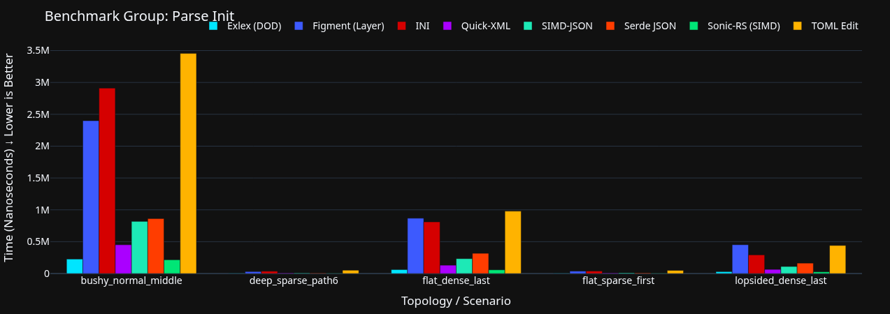
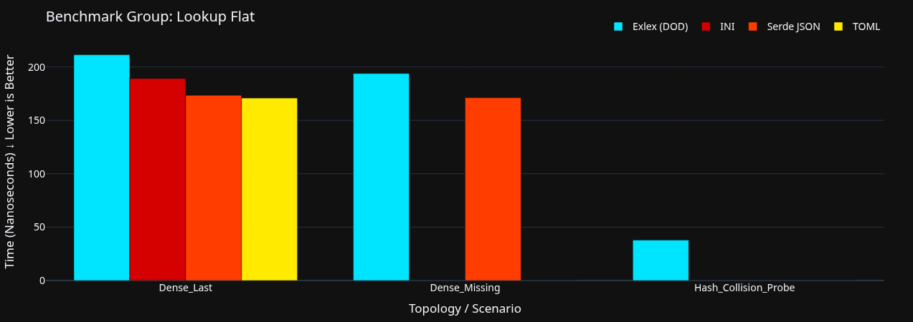
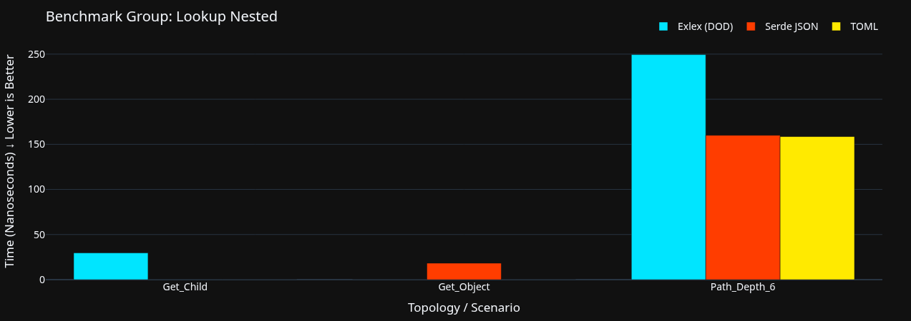
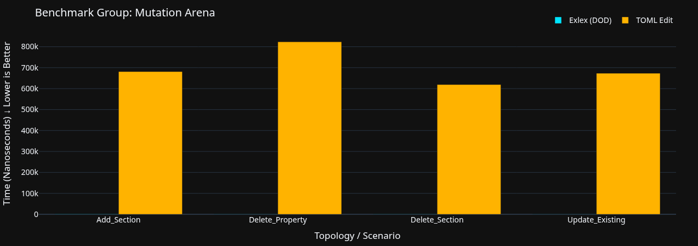
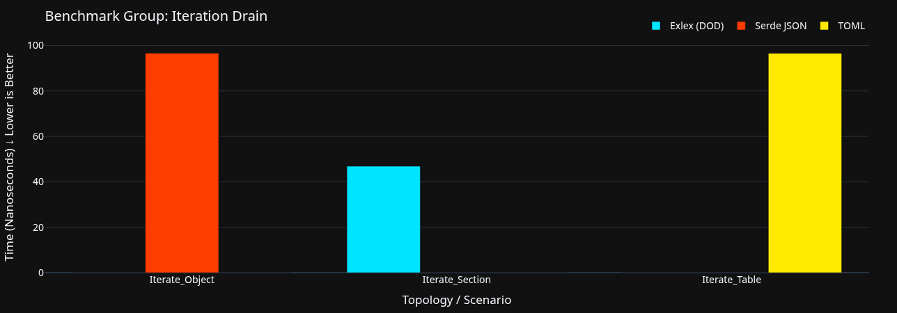

# Exlex 
> **STATUS: AT ALPHA STAGE** > *Readme is still a work in progress.*

Exlex is a config parser I built on 3 core rules:
1. **No structs inside an array**
2. **No Vectors inside Vectors**
3. **Minimize string copying to the absolute minimum** (I believe I am not copying strings at all inside the core of Exlex).

**Why?** Because it makes Exlex incredibly cache-friendly. When the total number of properties in a section isn't massive, a flat linear search heavily outperforms a HashMap or BTree due to memory contiguity.

## Syntax
```exl
# Comments were originally created so I can do some debugging
# All literals must be quoted!
"name": "Exlex"
"version": "1.0.0"

# A section can carry multiple properties and also supports nesting 
sect "Server" {
    "host": "127.0.0.1"
    "port": "8080"
}

sect "Database" {
    "driver": "postgres"
    "pool": "32"

    sect "ClientDB" {
        "host": "0.0.1"
        "port": "0980"
    }
    sect "LoremIpsum" {
        "user": "user1"
        "auth": "userauth"
    }
    sect "Credentials" {
        "user": "sys_admin"
        "auth": "ed25519"
    }
}

sect "Client" {
    "host": "127.0.0.1"
    "port": "8080"
}
````

## Pros and Cons

### Pros

  - **Data-Oriented Design & Cache friendliness** (TLB Miss was 0.007% and IPC was 1.7)
  - Support for `no_std`
  - Extremely low memory usage
  - SIMD acceleration on specific portions (Not the entire parser like `sonic-rs` or `simdjson` because that is too complex for me right now)
  - Minimalistic syntax (modified specifically for maximum parsing performance)
  - Lock-free data mutation via a separate arena
  - High-performance Parsing and Writing

### Cons

  - **No inbuilt Datatype support:** I am trying to keep it minimalistic. I feel it's not worth adding that overhead directly into the parser, but the interface does provide ways to handle it.
  - **No direct array support:** There is a workaround currently, but I am planning to implement native arrays later.

## Rules

To retain high performance for config files, the following rules are imposed by the parser:

  - Quotes are enforced on all literals.
  - All properties must be defined *before* defining a nested section in a scope.

-----

## Benchmarks

**Benchmark Repo:** [Exlex-Benchmark](https://github.com/cychronex-labs/Exlex-Benchmark)

*(Note: I wrote the core parser myself, but heavily utilized AI to help design and write this Benchmark Methodology).*

### 📊 Benchmark Methodology

To ensure `exlex` performs consistently across all use cases, the benchmark suite tests both **Operations** (what we do to the data) and **Topologies** (the physical shape of the data).

#### 1\. The Operations

  * **Parse Init:** Raw ingestion throughput. Measures how fast the engine converts a string into the flat-array DOD structure.
  * **Lookup Flat:** Key retrieval speed within a single section, testing both worst-case linear scans and hash-collision resolution.
  * **Lookup Nested:** Path traversal speed. Tests the cost of navigating down deeply nested section hierarchies.
  * **Iteration Drain:** Sequential reading speed. Proves the cache-locality advantage of flat arrays by iterating over every property in a section.
  * **Mutation Arena:** The speed of editing memory (Add, Update, Delete). Tests the performance of the lock-free, append-only arena.
  * **Roundtrip Pipeline:** A real-world lifecycle test. Times the full process of parsing a file, executing mass updates, and saving it back to a string.

#### 2\. The Data Topologies

Data shape heavily impacts CPU caching. We test against several mathematically generated shapes:

  * **Bushy Normal:** A balanced mix of depth and breadth (e.g., 3 levels deep, 5 branches per level, 10 properties each). This mimics a standard, real-world server or game config.
  * **Flat Dense:** Shallow sections, but packed with hundreds of properties. This explicitly stress-tests linear array scanning and cache prefetching.
  * **Flat Sparse:** Many shallow sections with only 1 or 2 properties each.
  * **Deep Sparse:** Extremely nested hierarchies (e.g., a section inside a section inside a section, 8 levels deep). This stresses pointer/path resolution.
  * **Wide Sparse:** Hundreds of parallel sections at the root level, simulating a massive directory-style config.
  * **Lopsided Dense:** One massive, heavy section sitting next to dozens of completely empty sections. This tests memory allocation and edge-case scaling.

### Results






