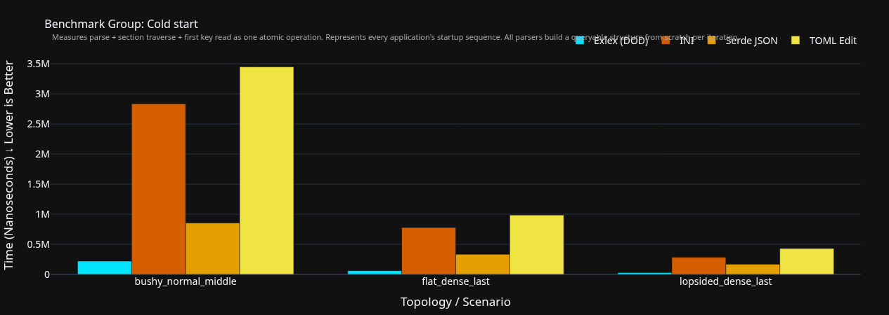
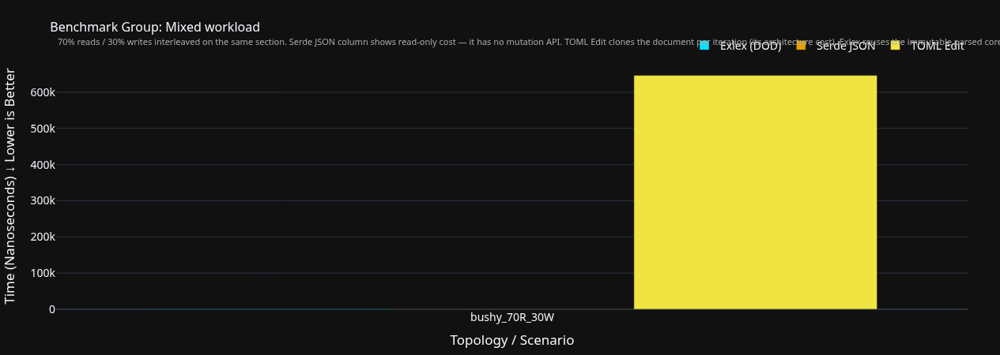
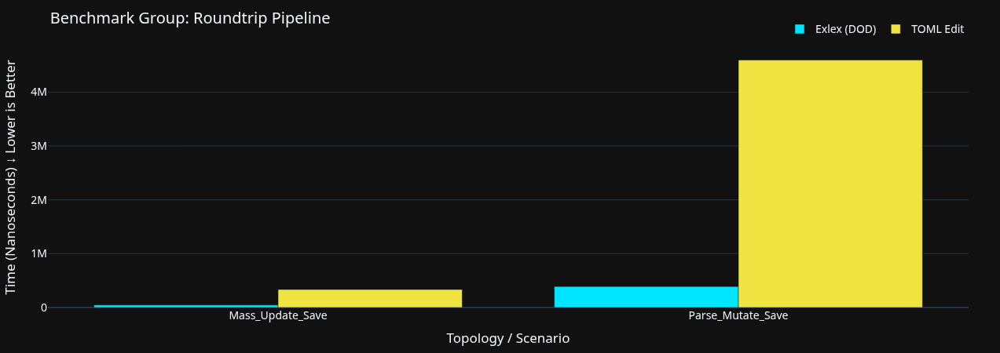
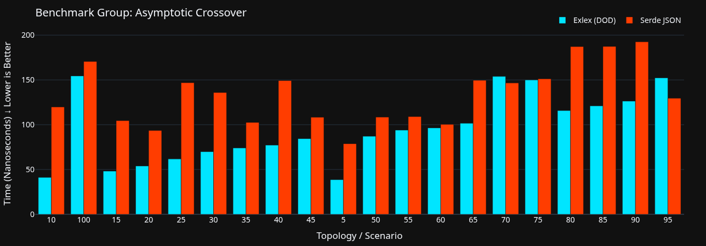
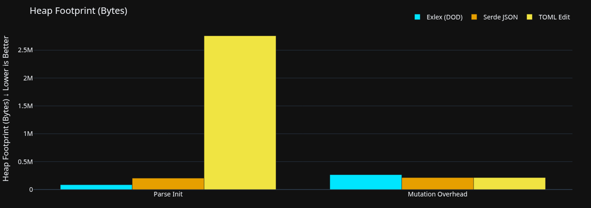
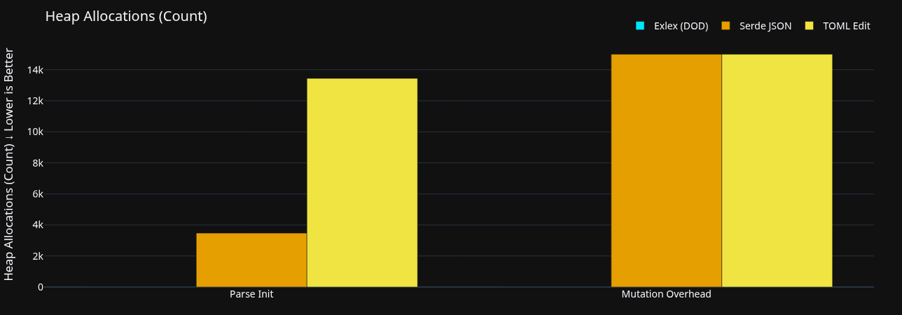

# Exlex 
> **STATUS: AT BETA STAGE** > *Readme is still a work in progress.*

Exlex is a config parser that uses SoA Architecture usually used in Game engines and Arena based mutator. Its not build to replace any existing configuration parsers. The advantage of exlex over most of others are a unique combination of:
- Zero copy immutable parser
- Native no_std support
- SIMD byte search via memchr on specific functions
- Supports modifying data and dumping it back into string (Arena mutator)
- Human readable format
- Low memory usage even on mutations

## What it is and What it does not aim to be:
- Built for hardware constraint environment.
- Built to be Cache-friendly and Memory friendly as much as it can.
- Built for overall speed in lifecycle of a program (Parse -> Read -> Mutate -> Save).
- Syntax specifically designed to make parser fast while maintaining human readability
- It is NOT a feature rich or highly flexible syntax (Use json or toml if you need dynamic typing or complex data structures).

## Issues
- Interface has a lot of work to do
- Docs are incomplete!
- Due to zero-copy architecture escape character has to be implemented

## Parser and Mutator Stability
- Proptested (AI have been used for proptest)
- for more details look at TESTING.md file
```bash
~/Projects/exlex_bench main*
❯ PROPTEST_CASES=10000 cargo test proptest_mutator_engine --release

test result: ok. 0 passed; 0 failed; 0 ignored; 0 measured; 0 filtered out; finished in 0.00s

     Running tests/proptest_fuzz.rs (target/release/deps/proptest_fuzz-6b0455884b22cdc2)

running 1 test
test proptest_mutator_engine ... ok

test result: ok. 1 passed; 0 failed; 0 ignored; 0 measured; 2 filtered out; finished in 5.87s
```

Quick Start (Rust API)
Exlex splits its lifecycle into two distinct phases: an immutable, zero-copy Reader and an allocation-efficient Mutator.

```rust
use exlex::{Exlex, ExlexArena};

fn main() {
    let config_data = r#"
    "name": "Exlex"
    "version": "1.0.0"

    sect "Server" {
        "host": "127.0.0.1"
        "port": "8080"
    }
    "#;

    // 1. Initialize the Zero-Copy Reader
    let exlex = Exlex::init_reader(config_data, None, None, None, None).unwrap();
    let root = exlex.get_root();

    // 2. Read Properties
    let name = exlex.get_property("name", root).unwrap();
    println!("Name: {}", name);

    // Retrieve typed properties from a nested section
    let server_sect = exlex.get_child("Server", root).unwrap();
    
    let port: u16 = exlex.get_property_as("port", server_sect).unwrap();
    
    // OR 
    // As Server is first defined section (0 is reserved as ROOT)
    // let server_sect = ExlexSection(1);
    // Benefit of this method, Completely overrides Linear Search of Section getting O(1) retrieval for sections
    // let port: u16 = exlex.get_property_as("port", server_sect).unwrap();


    println!("Port: {}", port);

    // 3. Mutate Data (Arena-based)
    let mut arena = ExlexArena(String::new());
    let mut write_buffer = String::new();
    
    let mut mutator = exlex.init_mutator(&mut arena, &mut write_buffer).unwrap();
    
    // Update existing property
    mutator.update_prop("port", "9000", server_sect);
    
    // Add a new section and property
    mutator.new_section("Database", root).unwrap();
    let db_sect = exlex.get_child("Database", root).unwrap(); // Or track via mutator state
    mutator.update_prop("driver", "postgres", db_sect);

    // 4. Save to String
    mutator.save();
    println!("Updated Config:\n{}", write_buffer);
}
```

## Syntax
```exl
# Comments were originally created so I can do some debugging
# All literals must be quoted!
"name": "Exlex"
"version": "1.0.0"

# A section can carry multiple properties and also supports nesting 
# Each user defined structure in top to down order gets +1 section id that it can be used directly via ExlexSection(<id>)

# Section id: 1
sect "Server" {
    "host": "127.0.0.1"
    "port": "8080"
}

# Section id: 2 
sect "Database" {
    "driver": "postgres"
    "pool": "32"

    # Section id: 3
    sect "ClientDB" {
        "host": "0.0.1"
        "port": "0980"
    }
    
    # Section id: 4
    sect "LoremIpsum" {
        "user": "user1"
        "auth": "userauth"
    }
    
    # Section id: 5
    sect "Credentials" {
        "user": "sys_admin"
        "auth": "ed25519"
    }
}

# Section id: 6
sect "Client" {
    "host": "127.0.0.1"
    "port": "8080"
}
```

## Rules

To retain high performance for config files, the following rules are imposed by the parser:
  - Quotes are enforced on all literals.
  - All properties must be defined *before* defining a nested section in a scope.

-----

*(Note: I wrote the core parser myself, but heavily utilized AI to help design and write this Benchmark).*

## Benchmarks
**Benchmark Repo:** [Exlex-Benchmark](https://github.com/cychronex-labs/Exlex-Benchmark)

### 📊 Benchmark Methodology

To ensure `exlex` performs consistently across all use cases, the benchmark suite tests both **Operations** (what we do to the data) and **Topologies** (the physical shape of the data).

#### 1\. The Operations

  * **Parse Init:** Raw ingestion throughput. Measures how fast the engine converts a string into the flat-array DOD structure.
  * **Cold Start:** Measures parse + section traverse + first key read as one atomic operation. Represents every application's startup sequence.
  * **Lookup Flat:** Key retrieval speed within a single section, testing both worst-case linear scans and hash-collision resolution.
  * **Lookup Nested:** Path traversal speed. Tests the cost of navigating down deeply nested section hierarchies.
  * **Iteration Drain:** Sequential reading speed. Proves the cache-locality advantage of flat arrays by iterating over every property in a section.
  * **Mutation Arena:** The speed of editing memory (Add, Update, Delete). Tests the performance of the lock-free, append-only arena.
  * **Mixed Workload:** Simulates real-world server config hot-reloading (70% reads / 30% writes interleaved). Tests the engine's ability to mutate and query simultaneously without allocator thrashing.
  * **Roundtrip Pipeline:** A real-world lifecycle test. Times the full process of parsing a file, executing mass updates, and saving it back to a string.
  * **Allocation Audit (DHAT):** Hooks into the global memory allocator to measure the exact byte footprint and `malloc` call count, mathematically proving the zero-copy claims.
  * **Asymptotic Crossover:** The algorithmic threshold test. Determines the exact property count where Exlex's $O(N)$ linear scan loses its L1 cache advantage and is overtaken by a traditional $O(1)$ HashMap. (Around 65-70 on Intel Core i3 6006U).

#### 2\. The Data Topologies

Data shape heavily impacts CPU caching. We test against several mathematically generated shapes:

  * **Bushy Normal:** A balanced mix of depth and breadth (e.g., 3 levels deep, 5 branches per level, 10 properties each). This mimics a standard, real-world server or game config.
  * **Flat Dense:** Shallow sections, but packed with hundreds of properties. This explicitly stress-tests linear array scanning and cache prefetching.
  * **Flat Sparse:** Many shallow sections with only 1 or 2 properties each.
  * **Deep Sparse:** Extremely nested hierarchies (e.g., a section inside a section inside a section, 8 levels deep). This stresses pointer/path resolution.
  * **Wide Sparse:** Hundreds of parallel sections at the root level, simulating a massive directory-style config.
  * **Lopsided Dense:** One massive, heavy section sitting next to dozens of completely empty sections. This tests memory allocation and edge-case scaling.

### Results



> **Cold Start:** Measures parse + section traverse + first key read as one atomic operation. Represents every application's startup sequence. All parsers build a queryable structure from scratch per iteration.



> **Mixed Workload:** 70% reads / 30% writes interleaved on the same section. *Note: Serde JSON column shows read-only cost (it has no mutation API). TOML Edit clones the document per iteration (its architecture cost). Exlex reuses the immutable parsed core and resets only the lightweight mutator overlay.*










### 🚀 Performance & Memory Summary

| Benchmark Category | Scenario | Exlex (DOD) | Industry Standard | Speedup / Diff |
| :--- | :--- | :--- | :--- | :--- |
| **Ingestion (Parse)** | Lopsided Dense | **29,579 ns** | 163,179 ns (Serde JSON) | **~5.5x Faster** |
| **Cold Start** | Parse+Traverse+Read (Bushy) | **221,089 ns** | 854,230 ns (Serde JSON) | **~3.8x Faster** |
| **Mutation (Delete)** | Section Removal | **496 ns** | 619,245 ns (TOML Edit) | **~1,247x Faster** |
| **Mixed Workload** | 70% Read / 30% Write | **1,194 ns** | 646,444 ns (TOML Edit) | **~541x Faster** |
| Lookup (Single) |	Dense Last (100 items) | 211 ns |	173 ns (Serde JSON) |	~1.2x Slower |
| Lookup (Nested)	| Path Depth 6 | 249 ns |	160 ns (Serde JSON) |	~1.5x Slower |
| **Iteration** | Section Drain | **46 ns** | 96 ns (Serde JSON) | **~2.0x Faster** |
| **Roundtrip** | Parse+Mutate+Save | **391,534 ns** | 4,594,995 ns (TOML Edit) | **~11.7x Faster** |
| **Memory Footprint** | Parse Init (DHAT) | **84 KB** | 2.7 MB (TOML Edit) | **~32x Smaller** |
| **Heap Allocations** | Parse Init (DHAT) | **16 calls** | 13,445 calls (TOML Edit) | **~840x Fewer** |
| **Heap Allocations** | Mutation (DHAT) | **13 calls** | 15,000 calls (TOML Edit) | **~1,153x Fewer** |

### Perf_stat output 
I measured the hardware execution on an **Intel i3-6006U (Skylake, 2C/4T, 2.0GHz)**:
* **Instructions Per Cycle (IPC):** **1.7**. This confirms the CPU's pipeline is nearly always fed and rarely waiting for memory stalls.
* **L1 Cache Locality:** By using flat parallel vectors instead of a standard node tree, I achieved a very high cache hit rate, mathematically evidenced by the **0.07% TLB miss rate**.

"These metrics were captured using `perf stat` on Linux. I'm focusing on Data-Oriented Design to maximize hardware efficiency, and these numbers represent the initial results of that approach."

### The Naming
**Exlex** - Comes from latin for **"Lawless"**. 
**Reasons**: 
- DOD-based parsers usually don't offer data mutation; I do, and it is exceptionally fast.
- Standard parsers default to HashMaps, but I use Linear Search. In usual configuration parsing, Linear scans outperforms Hashmap (in Intel Core i3 6006U, approx upto 65-75 properties). For continuous arrays of numbers, a linear search on a modern processor is incredibly fast.

### AI Usage
- AI has not been used in the code of Exlex other than for debugging and verifying the code for edge cases
- AI have been as stated heavily used in the Exlex-Benchmark repository which also includes the proptest
